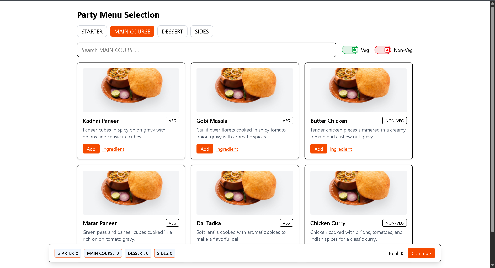

# 🍴 Party Menu – React App  

  
  
  
  
  
  

An interactive **Party Menu Web App** built with **React, Vite, Tailwind CSS**, and **React Router**.  
It allows users to explore **starters, main course, sides, and desserts** with ingredients.  
Includes **Veg/Non-Veg toggle filters** with visual indicators (🟩 square for Veg, 🔺 arrow for Non-Veg).  

---

## ✨ Features  

- ✅ **React + Vite** for blazing-fast development.  
- 🎨 **Tailwind CSS** for modern, responsive UI styling.  
- 🍲 **Dynamic dish categories** – Starters, Main Course, Sides, Desserts.  
- 🟢🔴 **Veg/Non-Veg toggle switch** with custom indicators.  
- 📦 **Ingredient dataset** included for each dish.  
- 🌐 **Deployed to GitHub Pages** using `gh-pages`.  
- 🔄 **HashRouter** for smooth routing on static hosting.  

---

## 📸 Preview




## 📂 Project Structure  

party-menu/
│── public/ # Static assets
│── src/
│ ├── components/ # UI components
│ ├── data/ # Dish + Ingredient dataset
│ ├── App.jsx # Main App component
│ ├── main.jsx # Entry file with HashRouter
│ └── index.css # Tailwind styles
│── package.json
│── tailwind.config.js
│── postcss.config.js
│── README.md


---

## 🥘 Example Datasets  

### **Main Course**
```json
{
  "id": 6,
  "name": "Chicken Curry",
  "type": "NON-VEG",
  "dishType": "CURRY",
  "description": "Chicken cooked with onions, tomatoes, and Indian spices for a classic curry."
}


🚀 Getting Started
1. Clone the repository

git clone https://github.com/prasad7659/party-menu.git

cd party-menu

2. Install dependencies
npm install

3. Start development server
npm run dev

4. Build for production
npm run build

5. Deploy to GitHub Pages
npm run deploy

🌍 Deployment

Deployed using GitHub Pages.

HashRouter is used to ensure routing works correctly on static hosting.

📸 Screenshots

👉 (Add screenshots here once UI is ready – like Veg/Non-Veg toggle, dish list, ingredients page, etc.)

🛠️ Tech Stack

React 18

Vite

Tailwind CSS

React Router DOM

GitHub Pages (gh-pages)

🤝 Contributing

Pull requests are welcome! If you’d like to suggest a new feature (like drinks 🥂 or snacks 🍟), feel free to open an issue.

📜 License

This project is licensed under the MIT License.
Feel free to use and modify for your own projects.